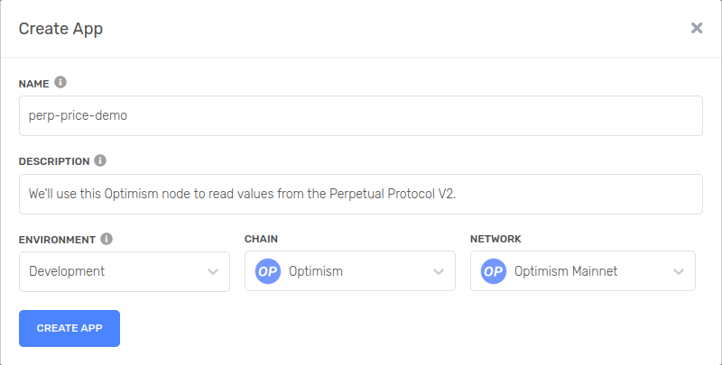
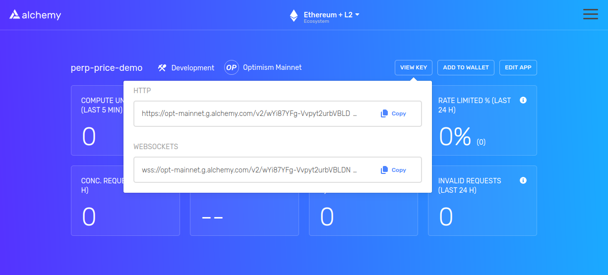

# How to get mark and index prices from Perpetual Protocol V2

The following guide will show you how to read the mark and index prices of the assets trading on the Perpetual Protocol V2. I figured out how to do this by reading the protocol's smart contract code, discovered publicly accessible functions, and called them appropiately. 

All the code that is outlined in this guide, is available in the same repository. If you get stuck at any point, go ahead and read the code or feel free to reach out to me and I'll see if I can help. 

## Environment

First up, let's setup our environment so we have something reproducible. Create an empty directory, navigate inside, and create a npm project. 

```
mkdir perp-price-demo
cd perp-price-demo
npm init -y
```

Now let's gather the necessary dependencies. The first one will be `hardhat`, which is an Ethereum development framework that helps with smart contract development and testing.

```
npm install --save-dev hardhat
```

In your terminal, run hardhat:

```
npx hardhat
```

You'll get the following output and select: `Create a basic sample project`, by pressing `enter`

```
888    888                      888 888               888
888    888                      888 888               888
888    888                      888 888               888
8888888888  8888b.  888d888 .d88888 88888b.   8888b.  888888
888    888     "88b 888P"  d88" 888 888 "88b     "88b 888
888    888 .d888888 888    888  888 888  888 .d888888 888
888    888 888  888 888    Y88b 888 888  888 888  888 Y88b.
888    888 "Y888888 888     "Y88888 888  888 "Y888888  "Y888

Welcome to Hardhat v2.8.3

? What do you want to do? … 
▸ Create a basic sample project
  Create an advanced sample project
  Create an advanced sample project that uses TypeScript
  Create an empty hardhat.config.js
  Quit
```

Select the default parameters by just hitting `enter`. You'll need to update your `package.json` by adding this entry:

```
"dependencies": {
  "@perp/curie-contract": "^1.0.14",
  "@perp/perp-oracle-contract": "^0.2.2",
  "@openzeppelin/contracts-upgradeable": "3.4.2",
  "@uniswap/v3-core": "^1.0.1",
  "@uniswap/v3-periphery": "^1.4.0",
  "dotenv": "^15.0.0"
}
```

Then run the following to install those dependencies:

```
npm i
```

While that's installing, here are some details on what you just installed:

- `@perp/curie-contract` contains the Perpetual Protocol V2 smart contracts.
- `@perp/perp-oracle-contract` contains periphery smart contracts that the Perpetual Protocol depends on.
- `@openzeppelin/contracts-upgradeable` are smart contracts that the Perpetual Protocol depends on.
- `@uniswap/v3-core` are smart contracts that the Perpetual Protocol depends on and we'll use to format the prices.
- `@uniswap/v3-periphery` are smart contracts that the Perpetual Protocol depends on.
- `dotenv` loads environment variables to securely manage secrets.

Following the code dependencies, we're going to need to get access to a node so we can interact with the blockchain.

### Alchemy

To interact with [Optimism](https://www.optimism.io/) (PerpV2 is deployed there), you're going to need to have access to a node, and I've choosen [Alchemy](https://alchemy.com/?r=dbbb251e37e26674) to achieve this. *Note: that link to Alchemy is my personal referral link.* After signing up, you're going to navigate to your dashboard and click the button that says "+ CREATE APP".

Go ahead and fill out the form that pops up:



Next click on the application you just created and then click the "VIEW KEY" button, and copy the http url:



Next create an `.env` file with the following contents:

```
export ALCHEMY_OPTIMISM=https://opt-mainnet.g.alchemy.com/v2/<private-key>
```

Update the `hardhat.config.js`. Add the following to the top of the file:

```
require("dotenv").config()
```

This will allow us to load the environment variables in our configuration. Now we'll modify our `module.exports` to look like this:

```
module.exports = {
  solidity: {
    compilers: [
      { version: "0.7.6" },
    ]
  },
  networks: {
    hardhat: {
      forking: {
        url: process.env.ALCHEMY_OPTIMISM
      }
    }
  },
};
```

The configurations you just added tells hardhat to use solidity compiler version 0.7.6 and to use a fork of the Optimism mainnet. After all that setup we're finally ready to write some code.

## Solidity

Go ahead and delete `contracts/Greeter.sol` and create a new file named `contracts/FetchPrice.sol`.

First define add the license identifier and the solidity version to the top of the file:

```
// SPDX-License-Identifier: GPL-2.0-or-later
pragma solidity 0.7.6;
```

Next let's import the Perp and Uniswap contracts that we're going to use:

```
import {BaseToken} from "@perp/curie-contract/contracts/BaseToken.sol";
import {ClearingHouse} from "@perp/curie-contract/contracts/ClearingHouse.sol";
import {ClearingHouseConfig} from "@perp/curie-contract/contracts/ClearingHouseConfig.sol";
import {Exchange} from "@perp/curie-contract/contracts/Exchange.sol";
import {FixedPoint96} from "@uniswap/v3-core/contracts/libraries/FixedPoint96.sol";
import {FullMath} from "@uniswap/v3-core/contracts/libraries/FullMath.sol";
```

Now let's define our contract:

```
contract FetchPrice {

}
```

And now we can start filling out the contents of the contract. Now lets create a few state variables. These will be references to Perp contracts found on-chain:

```
ClearingHouse clearingHouse;
ClearingHouseConfig clearingHouseConfig;
Exchange exchange;
```

The following function will take the ClearingHouse address and it will initialize all the state variables. The Perp ClearingHouse stores the addresses of the ClearingHouseConfig and Exchange, so we'll just ask it directly where those live:

```
function initialize(address _clearingHouseAddress) public {
    clearingHouse = ClearingHouse(_clearingHouseAddress);
    address clearingHouseConfigAddress = clearingHouse
        .getClearingHouseConfig();
    clearingHouseConfig = ClearingHouseConfig(clearingHouseConfigAddress);
    address exchangeAddress = clearingHouse.getExchange();
    exchange = Exchange(exchangeAddress);
}
```

Now we'll add a function that will read the ClearingHouseConfig and grab the TWAP interval. This is a necessary input parameter to get the mark and index price:

```
function getTwapInterval() public view returns (uint32) {
    return clearingHouseConfig.getTwapInterval();
}
```

Next we're going to add a couple helper functions. These will help format the mark price so something human readable:

```
function formatSqrtPriceX96ToPriceX96(uint160 sqrtPriceX96)
    internal
    pure
    returns (uint256)
{
    return FullMath.mulDiv(sqrtPriceX96, sqrtPriceX96, FixedPoint96.Q96);
}

function formatX96ToX10_18(uint256 valueX96)
    internal
    pure
    returns (uint256)
{
    return FullMath.mulDiv(valueX96, 1 ether, FixedPoint96.Q96);
}
```

Finally we'll add these functions that will read the mark and index price from the Perp contracts. They take in the BaseToken address and the TWAP interval as paramters and spit out the price:

```
function getMarkPrice(address _baseToken, uint32 _twapInterval)
    public
    view
    returns (uint256)
{
    uint160 sqrtMarkX96 = exchange.getSqrtMarkTwapX96(
        _baseToken,
        _twapInterval
    );
    uint256 markPriceX96 = formatSqrtPriceX96ToPriceX96(sqrtMarkX96);
    uint256 markPrice = formatX96ToX10_18(markPriceX96);
    return markPrice;
}

function getIndexPrice(address _baseToken, uint32 _twapInterval)
    public
    view
    returns (uint256)
{
    BaseToken baseToken = BaseToken(_baseToken);
    return baseToken.getIndexPrice(_twapInterval);
}
```

At the end of all that your smart contract should look like this:

```
// SPDX-License-Identifier: GPL-2.0-or-later
pragma solidity 0.7.6;

import {BaseToken} from "@perp/curie-contract/contracts/BaseToken.sol";
import {ClearingHouse} from "@perp/curie-contract/contracts/ClearingHouse.sol";
import {ClearingHouseConfig} from "@perp/curie-contract/contracts/ClearingHouseConfig.sol";
import {Exchange} from "@perp/curie-contract/contracts/Exchange.sol";

import {FixedPoint96} from "@uniswap/v3-core/contracts/libraries/FixedPoint96.sol";
import {FullMath} from "@uniswap/v3-core/contracts/libraries/FullMath.sol";

contract FetchPrice {
    ClearingHouse clearingHouse;
    ClearingHouseConfig clearingHouseConfig;
    Exchange exchange;

    function initialize(address _clearingHouseAddress) public {
        clearingHouse = ClearingHouse(_clearingHouseAddress);
        address clearingHouseConfigAddress = clearingHouse
            .getClearingHouseConfig();
        clearingHouseConfig = ClearingHouseConfig(clearingHouseConfigAddress);
        address exchangeAddress = clearingHouse.getExchange();
        exchange = Exchange(exchangeAddress);
    }

    function getTwapInterval() public view returns (uint32) {
        return clearingHouseConfig.getTwapInterval();
    }

    function formatSqrtPriceX96ToPriceX96(uint160 sqrtPriceX96)
        internal
        pure
        returns (uint256)
    {
        return FullMath.mulDiv(sqrtPriceX96, sqrtPriceX96, FixedPoint96.Q96);
    }

    function formatX96ToX10_18(uint256 valueX96)
        internal
        pure
        returns (uint256)
    {
        return FullMath.mulDiv(valueX96, 1 ether, FixedPoint96.Q96);
    }

    function getMarkPrice(address _baseToken, uint32 _twapInterval)
        public
        view
        returns (uint256)
    {
        uint160 sqrtMarkX96 = exchange.getSqrtMarkTwapX96(
            _baseToken,
            _twapInterval
        );
        uint256 markPriceX96 = formatSqrtPriceX96ToPriceX96(sqrtMarkX96);
        uint256 markPrice = formatX96ToX10_18(markPriceX96);
        return markPrice;
    }

    function getIndexPrice(address _baseToken, uint32 _twapInterval)
        public
        view
        returns (uint256)
    {
        BaseToken baseToken = BaseToken(_baseToken);
        return baseToken.getIndexPrice(_twapInterval);
    }
}
```

## JavaScript

Now lets write the script that will deploy our contract on a forked network and call the functions that will read the data stored in the Perpetual Protocol's smart contracts. First up, delete the `scripts/sample-script.js` and create a new file named `scripts/fetchPrice.js`. In this new file we need to import a dependency from hardhat and some relevant on-chain address, so go ahead and add the following:

```
const hre = require("hardhat");

const ADDRESSES = {
    clearing_house: "0x82ac2CE43e33683c58BE4cDc40975E73aA50f459",
    veth: "0x8c835dfaa34e2ae61775e80ee29e2c724c6ae2bb",
    vbtc: "0x86f1e0420c26a858fc203a3645dd1a36868f18e5"
}
```

Now let's add a `main` function:
```
async function main() {

}
```

Next up let's fill the `main` function. First we'll need to deploy the contract. This uses the `hardhat` runtime environment to grab the smart contract we wrote, deploy it, wait for it to be deployed, and print out the address it was deployed at:

```
console.log("Deploying FetchPrice...")
const FetchPrice = await hre.ethers.getContractFactory("FetchPrice");
const fetchPrice = await FetchPrice.deploy();
await fetchPrice.deployed();
console.log("FetchPrice deployed to: ", fetchPrice.address);
```

The smart contract needs to be initialized so it knows where to read the relevant data. Add the following to feed it the ClearingHouse address and the rest of the `initialize` function will grab the ClearingHouseConfig and Exchange:

```
console.log("Initializing FetchPrice...")
await fetchPrice.initialize(ADDRESSES.clearing_house)
```

Now we need to get the `TWAP interval` because that is an input parameter when retrieving the mark and index price. Add the following to the `main` function:

```
console.log("Getting TWAP interval...")
const twapInterval = await fetchPrice.getTwapInterval()
console.log(twapInterval)
```

Now all that remains for the `main` function is to read the mark and index price. Adding the following will give each function we wrote in the smart contract the BaseToken and TWAP interval:

```
console.log("Getting vbtc mark price...")
const vbtcMark = await fetchPrice.getMarkPrice(ADDRESSES.vbtc, twapInterval)
console.log(vbtcMark / 10 ** 18)

console.log("Getting btc index price...")
const btcIndex = await fetchPrice.getIndexPrice(ADDRESSES.vbtc, twapInterval)
console.log(btcIndex / 10 ** 18)

console.log("Getting veth mark price...")
const vethMark = await fetchPrice.getMarkPrice(ADDRESSES.veth, twapInterval)
console.log(vethMark / 10 ** 18)

console.log("Getting eth index price...")
const ethIndex = await fetchPrice.getIndexPrice(ADDRESSES.veth, twapInterval)
console.log(ethIndex / 10 ** 18)
```

You may notice that I am dividing the output by 10^18 and thats because the smart contract is returning the values with the `wei` to `ether` conversion. (`1 ether` is `10^18 wei`). 

Lastly, we need to call the main function, so add this at the bottom of the file to do that: 

```
main()
    .then(() => process.exit(0))
    .catch((error) => {
        console.error(error);
        process.exit(1);
    });
```

At the end of all that, your script should look like the following:

```javascript
const hre = require("hardhat");

const ADDRESSES = {
    clearing_house: "0x82ac2CE43e33683c58BE4cDc40975E73aA50f459",
    veth: "0x8c835dfaa34e2ae61775e80ee29e2c724c6ae2bb",
    vbtc: "0x86f1e0420c26a858fc203a3645dd1a36868f18e5"
}

async function main() {
    console.log("Deploying FetchPrice...")
    const FetchPrice = await hre.ethers.getContractFactory("FetchPrice");
    const fetchPrice = await FetchPrice.deploy();
    await fetchPrice.deployed();
    console.log("FetchPrice deployed to: ", fetchPrice.address);

    console.log("Initializing FetchPrice...")
    await fetchPrice.initialize(ADDRESSES.clearing_house)

    console.log("Getting TWAP interval...")
    const twapInterval = await fetchPrice.getTwapInterval()
    console.log(twapInterval)

    console.log("Getting vbtc mark price...")
    const vbtcMark = await fetchPrice.getMarkPrice(ADDRESSES.vbtc, twapInterval)
    console.log(vbtcMark / 10 ** 18)

    console.log("Getting btc index price...")
    const btcIndex = await fetchPrice.getIndexPrice(ADDRESSES.vbtc, twapInterval)
    console.log(btcIndex / 10 ** 18)

    console.log("Getting veth mark price...")
    const vethMark = await fetchPrice.getMarkPrice(ADDRESSES.veth, twapInterval)
    console.log(vethMark / 10 ** 18)

    console.log("Getting eth index price...")
    const ethIndex = await fetchPrice.getIndexPrice(ADDRESSES.veth, twapInterval)
    console.log(ethIndex / 10 ** 18)
}

main()
    .then(() => process.exit(0))
    .catch((error) => {
        console.error(error);
        process.exit(1);
    });
```

### Expected Output

If all has gone well, we can run the script with `hardhat` with the following command:

```
npx hardhat run scripts/fetchPrice.js
```

and you should get something similar to the following output:

```
Deploying FetchPrice...
FetchPrice deployed to:  0xe7f1725E7734CE288F8367e1Bb143E90bb3F0512
Initializing FetchPrice...
Getting TWAP interval...
900
Getting vbtc mark price...
42717.62555622542
Getting btc index price...
42677.27626666
Getting veth mark price...
2939.2235053411996
Getting eth index price...
2937.5449666600002
```

## Conclusion

[This](https://github.com/sbvegan/perpetual-protocol-developer-guide-grant) is a link to the full code repository. I had a lot of fun learning about the Perpetual Protocol and I plan to continue on learning and contributing. Please feel free to reach out with questions or if you'd like me to put together any specific content.
